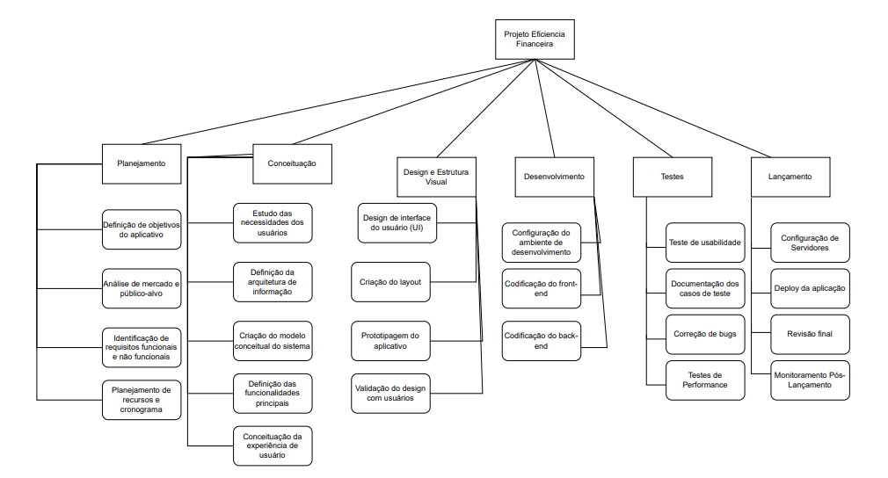
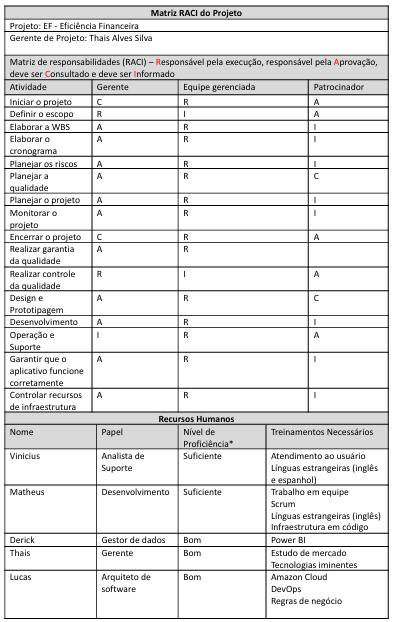

# Planejamento

> A fase de planejamento na gerência de projetos é um momento onde os detalhes do projeto são minuciosamente definidos para garantir uma execução bem-sucedida. 
> Durante essa etapa, os gerentes de projeto e suas equipes elaboram um plano abrangente que aborda aspectos como cronograma, orçamento, recursos necessários, riscos identificados e métodos de controle. 
> O objetivo é criar uma estrutura que guiará as atividades ao longo do projeto, garantindo que metas sejam alcançadas de maneira eficiente. 
> O plano de projeto não apenas define as tarefas específicas e suas interdependências, mas também estabelece critérios de sucesso e indicadores de desempenho. 
> A qualidade do planejamento influencia diretamente a capacidade da equipe em cumprir prazos, alocar recursos eficientemente e lidar com desafios que possam surgir durante a execução.

# Estrutura do Documento

- [Fase de Planejamento](#planejamento)
- [Escopo do Projeto](#escopo-do-projeto)
- [Estrutura Analítica do Projeto](#estrutura-analítica-do-projeto)
- [Matriz de Responsabilidades](#matriz-de-responsabilidades)
- [Cronograma do Projeto](#cronograma-do-projeto)
- [Orçamento do Projeto](#orçamento-do-projeto)
- [Planos de Gerenciamento](#planos-de-gerenciamento)
  - [Plano de Qualidade](#plano-de-qualidade)
  - [Plano de Aquisição](#plano-de-aquisição)
  - [Plano de Comunicação](#plano-de-comunicação)
  - [Plano de Riscos](#plano-de-riscos)

-----
```diff
+ Tarefa 04:
+ Escopo e Estrutura Analítica do Projeto
```

# Escopo do Projeto

......  COLOQUE AQUI O SEU TEXTO ......

Concepção e Planejamento: Definir os objetivos do aplicativo, identificar as necessidades dos usuários e criar o escopo inicial. 
Design e Prototipagem: Criar a interface visual e o fluxo do aplicativo com foco na usabilidade e experiência do usuário.
Desenvolvimento: Implementar as funcionalidades e integrar as ferramentas necessárias, criando a primeira versão funcional.
Testes (QA): Garantir que o aplicativo funcione corretamente, corrigindo bugs e melhorando o desempenho.
Lançamento e Implementação: Publicar o aplicativo e disponibilizá-lo para o público. 
Operação e Suporte: Manter e atualizar o aplicativo, corrigindo problemas e adicionando melhorias.
Encerramento: Revisar os resultados do projeto e documentar as lições aprendidas.

# Estrutura Analítica do Projeto





### Documento Editável

> Você deve atualiza o seguinte link (ou link correspondente), como o arquivo editável de geração da WBS:
- Estrutura Analítica do Projeto - Editável (https://app.diagrams.net/#G1bQSXLYWLiowlWbX1nLE5eqmxqZTj3DsJ#%7B%22pageId%22%3A%22QFYPgByo6CgZOsBWS8I_%22%7D)

```diff
+ Tarefa 04:
+ Fim da seção a ser atualizada.
```

-----
```diff
+ Tarefa 05:
+ Matriz de Responsabilidades (RACI)
```

# Matriz de Responsabilidades

......  COLOQUE AQUI O SEU TEXTO ......





### Documento Editável

> Você deve atualiza o seguinte link (ou link correspondente), como o arquivo editável da Matriz RACI:
Matriz de Responsabilidades (RACI) - Editável = https://docs.google.com/document/d/1IRRBrPgstbWZD4h3LFc0Aaetompxyq5R7oj0gE4LfOY/edit?usp=sharing

```diff
+ Tarefa 05:
+ Fim da seção a ser atualizada.
```

-----
```diff
+ Tarefa 07:
+ Cronograma do Projeto
```

# Cronograma do Projeto

......  DESCREVA EM LINHAS GERAIS O CRONOGRAMA DO SEU PROJETO AQUI ......

O cronograma do Projeto EF - Eficiência Financeira foi elaborado para detalhar todas as atividades, marcos e eventos essenciais ao longo do ciclo de vida do projeto, utilizando técnicas de análise de rede (como PERT/CPM) e estimativas de duração. O cronograma está estruturado de forma a otimizar recursos, antecipar potenciais atrasos e permitir ajustes contínuos, garantindo que o projeto seja concluído dentro do prazo estabelecido.

### Documento Editável

> Você deve atualiza o seguinte link (ou link correspondente), como o arquivo editável do Cronograma do Projeto:
- [Cronograma - Editável](artefatos/cronogramaP.mpp)
- [Orçamento do Projeto - Editável](artefatos/orcamentoP.mpp)
```diff
+ Tarefa 07:
+ Fim da seção a ser atualizada.
```

-----
```diff
+ Tarefa 08:
+ Orçamento do Projeto
```

# Orçamento do Projeto

......  DESCREVA EM LINHAS GERAIS O ORÇAMENTO DO SEU PROJETO AQUI ......

O orçamento do Projeto EF - Eficiência Financeira foi elaborado com base nas estimativas de recursos necessários para garantir a execução bem-sucedida do projeto, levando em consideração todos os custos diretos e indiretos, bem como despesas operacionais e investimentos essenciais. Este orçamento serve como uma ferramenta crucial para a gestão financeira do projeto, ajudando na alocação eficiente dos recursos ao longo de seu ciclo de vida.

### Documento Editável

> Você deve atualiza o seguinte link (ou link correspondente), como o arquivo editável do Orçamento do Projeto:
- [Orçamento do Projeto - Editável](artefatos/orcamentoP.mpp)

```diff
+ Tarefa 08:
+ Fim da seção a ser atualizada.
```

# Planos de Gerenciamento

> Os planos de gerenciamento do projetos consolidam as diretrizes e estratégias para a execução bem-sucedida de um empreendimento. 
> Ele abrange diversos aspectos, como escopo, cronograma, custos, riscos, qualidade, recursos humanos, comunicação e aquisições, proporcionando uma visão abrangente e integrada do projeto. 
> Este plano funciona como um guia mestre que orienta a equipe de projeto e as partes interessadas ao longo do ciclo de vida do projeto, estabelecendo expectativas, responsabilidades e processos. 
> Além disso, serve como um instrumento de comunicação, alinhando as expectativas entre os membros da equipe e as partes interessadas, mitigando riscos e fornecendo uma estrutura sólida para a tomada de decisões. 

```diff
+ Tarefa 09:
+ Checklist de Qualidade
```

## Plano de Qualidade


> [Checklist de Qualidade Documento](artefatos/PlanoDeQualidade-Feito.pdf)

### Artefatos a serem verificados

| Artefato   | Tipo Verif. | Data        | Responsável | Métrica     | Data Correção | Ação Não Conform. | Resp. Avaliação | Resp. Correção |
|------------|-------------|-------------|-------------|-------------|---------------|-------------------|-----------------|----------------|
|Documentação|Revisão |31/10/2024 |Derick Rodrigues|Conformidade de acordo com arquitetura |07/11/2024 |Correção com melhorias |Gerente de Projeto |Equipe de documentação|
|Prototipagem de design |Teste de Usabilidade|05/11/2024|Vinicius Célio|Tempo de clareza e respostas|11/11/2024|Ajuste de telas e fluxos|Gerente de Ux/Ui
|Equipe de ux/ui|
|Código fonte |             |             |             |             |               |                   |                 |                |
|Aplicativo Final |             |             |             |             |               |                   |                 |                |
|            |             |             |             |             |               |                   |                 |                |
|            |             |             |             |             |               |                   |                 |                |

### Padrões e Normas Utilizadas

| Nome       | Descrição   | 
|------------|-------------|
|            |             |
|            |             |
|            |             |
|            |             |
|            |             |

### Ambiente das Atividades de Qualidade

| Ambiente   | Descrição   | 
|------------|-------------|
|            |             |
|            |             |
|            |             |
|            |             |

### Equipe de Qualidade

| Nome       | Responsabilidade | 
|------------|------------------|
|            |                  |
|            |                  |
|            |                  |
|            |                  |
|            |                  |

### Metodologias de Qualidade Utilizadas

| Nome       | Descrição   | 
|------------|-------------|
|            |             |
|            |             |
|            |             |

```diff
+ Tarefa 09:
+ Fim da seção a ser atualizada.
```

```diff
+ Tarefa 10:
+ Especificação de Produto para Aquisição
```

## Plano de Aquisição

> O Plano de Aquisições define o processo relacionado à aquisição de bens e serviços necessários para a execução do projeto. 
> Este plano abrange a identificação de necessidades, a seleção de fornecedores, a elaboração de contratos, e a gestão do relacionamento com os fornecedores durante do ciclo de vida do projeto. 
> O Plano de Aquisições visa garantir a aquisição eficiente e eficaz dos recursos necessários, minimizando riscos e custos. 
> Além disso, ele proporciona transparência nas relações com fornecedores, promovendo a conformidade com os prazos estabelecidos e padrões de qualidade. 

### Documento Editável

> Você deve atualiza o seguinte link (ou link correspondente), como o arquivo editável de geração da WBS:
- [Especificação Produto Aquisição - Editável](artefatos/aquisicao_produtos.docx)


```diff
+ Tarefa 10:
+ Fim da seção a ser atualizada.
```

```diff
+ Tarefa 11:
+ Plano de Comunicação
```

## Plano de Comunicação

...... DESCREVA SUCINTAMENTE O PLANO DE COMUNICAÇÃO UTILIZADO NO PROJETO ......

> O Plano de Comunicação estabelece estratégias e diretrizes para facilitar a troca de informações entre os membros da equipe e as partes interessadas. 
> Este plano abrange aspectos como os meios de comunicação, a frequência das atualizações, os canais de distribuição de informações e os responsáveis pela comunicação. 
> Uma comunicação eficiente não apenas previne mal-entendidos e conflitos, mas também fortalece o engajamento da equipe e o apoio das partes interessadas. 
>
> Você pode utilizar como referência o seguinte documento:
- [Plano de Gerenciamento de Comunicação - Editável](artefatos/plano_comunicacao.docx)

### Plano de Comunicação do Projeto

| Entregável                         | Público-Alvo | Método de Comunicação | Frequência  | Responsável | 
|------------------------------------|--------------|-----------------------|-------------|-------------|
| Ata de reunião                     |              |                       |             |             |
| Declaração de escopo               |              |                       |             |             |
| WBS                                |              |                       |             |             |
| Dicionário da WBS                  |              |                       |             |             |
| Cronograma                         |              |                       |             |             |
| Lista de Riscos                    |              |                       |             |             |
| Plano de qualidade                 |              |                       |             |             |
| Plano de projeto                   |              |                       |             |             |
| Relatório de Progresso             |              |                       |             |             |
| Relatório de Aderência ao Processo |              |                       |             |             |
| Checklists de Inspeção             |              |                       |             |             |
|                                    |              |                       |             |             |
|                                    |              |                       |             |             |
|                                    |              |                       |             |             |

> Legenda:
> - Público: a quem se destina a comunicação.
> - Método de Comunicação: e-mail, reunião presencial, reunião virtual, etc.
> - Frequência: diária, semanal, quinzenal, mensal, etc.
> - Responsável: pessoa responsável pela comunicação.

### Plano de Gerência de Configuração

> Indique:
> - Ferramentas utilizadas no projeto - adicionar link de acesso às ferramentas
> - Papéis: responsáveis pelas correspondentes no projeto
> - Princípios gerais: indica quais princípios serão adotados no plano de comunicação, como clareza, objetividade, impessoalidade, imparcialidade e cordialidade. Detalhar.
>
> Plano de Gerência de Configuração: definir, em linhas gerais, como (ferramenta) serão controladas e distribuídas as versões e se haverá algum controle de responsabilidades.

- Ferramentas utilizadas:
- - [Ferramenta 01](https://pucminas.br)
  - [Ferramenta 02](https://pucminas.br)
  - [Ferramenta 03](https://pucminas.br)
- Papéis:
- - ...
  - ...
  - ...
- Princípios gerais
- - ...
  - ...
  - ...
  - ...

```diff
+ Tarefa 11:
+ Fim da seção a ser atualizada.
```

```diff
+ Tarefa 12:
+ Riscos do Projeto
```

## Plano de Riscos

......  COLOQUE AQUI O SEU TEXTO ......


> O plano de riscos busca antecipar, avaliar e mitigar os desafios potenciais que podem surgir ao longo do projeto. 
> Este documento estratégico oferece uma visão global dos riscos, categorizando-os e delineando estratégias para lidar com cada uma das possíveis adversidades. 
> Inicialmente, é realizada a identificação detalhada dos riscos, abrangendo desde ameaças imprevistas até oportunidades que podem ser exploradas. 
> Uma vez catalogados, os riscos são avaliados quanto à sua probabilidade de ocorrência e impacto, permitindo a priorização e foco em áreas críticas.
>
> O plano de riscos não apenas destaca os perigos em potencial, mas também estabelece respostas e estratégias de contingência. 
> Isso inclui a definição de ações preventivas para mitigar riscos antes que se materializem, bem como estratégias de mitigação para minimizar seu impacto se ocorrerem. 
> Além disso, a identificação de pontos de monitoramento contínuo ao longo do projeto permite uma resposta ágil às mudanças nas condições do ambiente.
>
> Você pode utilizar como referência o seguinte documento:
- [Plano de Gerenciamento de Riscos - Editável](artefatos/plano_riscos.xls)

| Categoria do Risco  | Descrição do Risco | Impacto       | Risco         | Medidas de Prevenção (Contramedidas) | Medidas de Contingência (Mitigação) | 
|---------------------|--------------------|---------------|---------------|--------------------------------------|-------------------------------------|
|                     |                    |               |               |                                      |                                     |
|                     |                    |               |               |                                      |                                     |
|                     |                    |               |               |                                      |                                     |
|                     |                    |               |               |                                      |                                     |
|                     |                    |               |               |                                      |                                     |
|                     |                    |               |               |                                      |                                     |
|                     |                    |               |               |                                      |                                     |
|                     |                    |               |               |                                      |                                     |
|                     |                    |               |               |                                      |                                     |
|                     |                    |               |               |                                      |                                     |

> Indique:
> Categoria do Risco: *ex.: Cliente, Cronograma, Orçamento, Aquisição de produtos, etc*
> Descrição do Risco: *ex.: Cliente não aparenta ter muito interesse no projeto*
> Impacto: *Baixo / Médio / Alto*
> Risco: *Baixo / Médio / Alto*
> Medidas de Prevenção: *Medidas que devem ser adotadas para evitar que o risco se concretize*
> Medidas de Contingência: *Medidas que devem ser adotadas caso o risco se concretize*
>
> *Obs.: Para determinar o risco considere a seguinte combinação entre Probabilidade e Impacto:

| Probabilidade | Impacto       | Risco         |
|---------------|---------------|---------------|
| Baixo         | Baixo         | Baixo         |
| Médio         | Médio         | Médio         |
| Alto          | Alto          | Alto          |
| Baixo         | Médio         | Médio         |
| Médio         | Baixo         | Médio         |
| Baixo         | Alto          | Médio         |
| Alto          | Baixo         | Médio         |
| Médio         | Alto          | Alto          |
| Alto          | Médio         | Alto          |


```diff
+ Tarefa 12:
+ Fim da seção a ser atualizada.
```

-----


